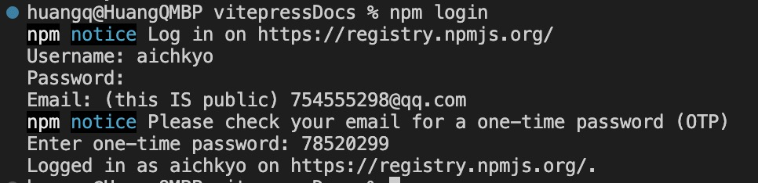

# 发布npm包

## 1.切换镜像源


```shell
# 原始方式
 npm config set registry https://registry.npmjs.org/

# nrm包管理工具

# 列出npm源
nrm ls 

# 使用npm官方源
nrm use npm  
```

## 2.package.json

项目没有package.json,需要 <code>npm init -y</code>


## 3. 登陆npm
没有帐号则需要先去 [npm官网](https://www.npmjs.com/)注册一个账号。
然后执行命令登陆
```shell
npm login
# 输入 账号
# 输入 密码
# 输入 验证码
```



## 4. 升级包版本
如若该包进行更新后，需要再次发包，可 npm version 控制该版本进行升级，记住需要遵守 [Semver 规范](https://semver.org/lang/zh-CN/):

```bash
# 增加一个修复版本号: 1.0.1 -> 1.0.2 (自动更改 package.json 中的 version 字段)
npm version patch

# 增加一个小的版本号: 1.0.1 -> 1.1.0 (自动更改 package.json 中的 version 字段)
npm version minor

```

## 5. 发布npm包
需要在package.json中添加name、version、description等字段，然后执行命令

```js
{
  ...
  "name": 'hroa-ui', // 包名
  "version": 0.0.1,
  "main": "./dist/hrui.common.js", // 指定项目的入口文件地址
  "description": "hroa-ui 是我们的组件库", // 关于这个包的描述文件
  "files": [ // 发布包需要带上文件，否则会根据.gitignore、.npmignore忽略掉文件
    "dist",
    "examples",
    "packages"
  ],
  "prepublishOnly": "npm run lib", // 执行npm publish的前置钩子(可配置)
  ...
}
```
```shell
npm publish
```


## 6.拓展

changelog 是手动档还是选择用工具生成
