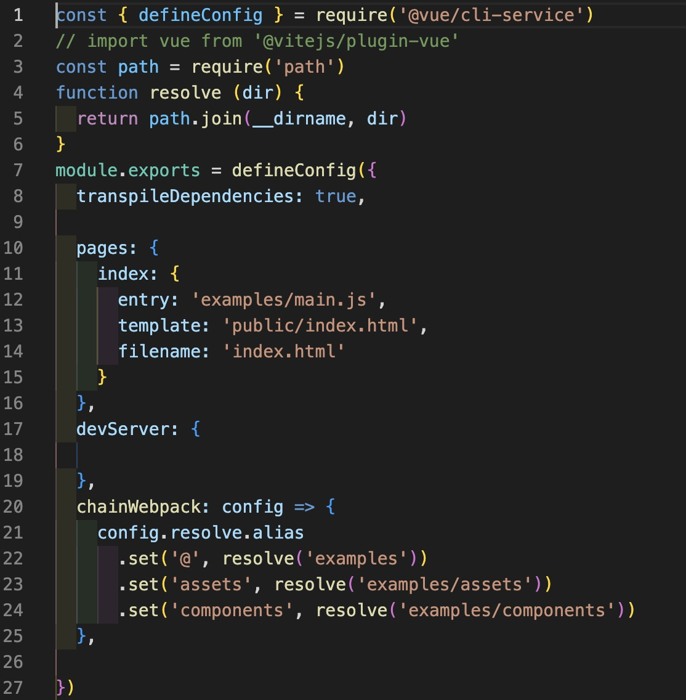
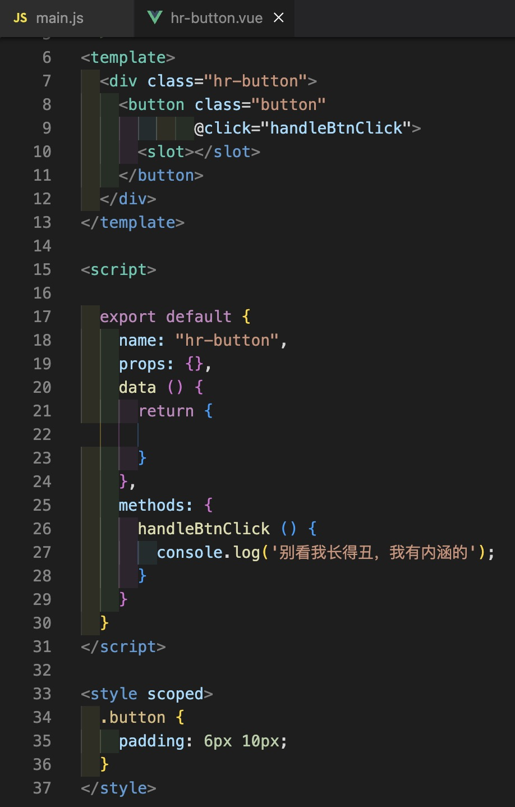

# 开发一个UI组件库

```shell
# 安装vue脚手架
npm install -g @vue/cli
# 创建一个项目，跟着脚手架的提示一步一步完成
vue create hroa-ui

```

## 改造目录 -- src->examples

常规项目源文件会在src目录下，组件库项目的入口文件不在此，故为了区分两者的差别，我们将src改为examples，后续可以在examples引入我们自己写的UI组件进行引用调试。

<code>目录结构</code>


## 改造入口 -- vue.config.js
因为项目目录结构默认入口为 src/main.js，我们修改后src项目可能跑不起来，所以需要在配置文件中修改项目的入口文件指向 entry。

如图所示，此为vue-cli3版本的修改示例，其他版本同理。

<code>vue.config.js</code>



## 新增库文件夹 -- packages

packages为我们组件库的文件夹，我们可以在此创建多个组件。

比如，我们现在需要做一个按钮的公共组件，就得为每一个组件创建一个文件夹，方便我们管理后续导出。

在packages中新增文件夹hr-button，名字可以根据功能或者规范自己取。

## 新增库组件 -- hr-button

在hr-button文件中,新增index.js和hr-button.vue文件。我这里创建把.vue文件放在src中，后续组件变大好维护。

<code>hr-button/src/hr-button.vue</code>

{width="300px"}

定义一个导出这个<code>hr-button</code>vue组件的js文件。为什么要创建这个文件下面解释

<code>hr-button/index.js</code>


## 新增库输出文件 -- 导出install

在我们写完组件后，怎么去使用它呢。

vue引入组件的方式就两种，一种是组件引入Vue.components()，一种是插件注册Vue.use()。

所以我们就需要给组件定义一个install方法，方便引入组件的时候使用Vue.use注册组件。

<code>packages/index.js</code>


到此为止，我们的组件库开发基础工作已经完成了，剩下就是完善其他组件、打包、发布。


## 打包 -- vue-cli脚手架

[vue-cli-service-build](https://cli.vuejs.org/zh/guide/cli-service.html#vue-cli-service-build) 官方使用说明

```json
"lib": "vue-cli-service build --target lib --name hrui ./packages/index.js"
```
<code> --target lib</code>意思是让脚手架帮我们打包成各个模块化规范的库文件。

<code> --name hrui </code>意思是打包生成 hrui名称的文件。 如 hrui.common.js、hrui.umd.js、hrui.css

<code>./packages/index.js</code>  打包的入口文件

执行 lib 命令 <code> npm run lib </code>，等待打包结束看 dist 文件夹

除此之外，还需要在<code>package.json</code>中新增main字段。

```json
{
  ...
  "main": "./dist/hrui.common.js", // 表示commonJs引入这个包后的入口文件地址
  "module": "" // 表示ESM引入这个包后的入口文件地址
  ...
}
```


## 打包 -- 配置webpack

```js

const fs = require('fs');
const path = require('path');
const join = path.join;
//  获取基于当前路径的目标文件
const resolve = dir => path.join(__dirname, '../', dir);

function getComponentEntries(path) {
    let files = fs.readdirSync(resolve(path));
    const componentEntries = files.reduce((fileObj, item) => {
        //  文件路径
        const itemPath = join(path, item);
        //  在文件夹中
        const isDir = fs.statSync(itemPath).isDirectory();
        const [name, suffix] = item.split('.');
        //  文件中的入口文件
        if (isDir) {
            fileObj[item] = resolve(join(itemPath, 'index.js'));
        }
        //  文件夹外的入口文件
        else if (suffix === 'js') {
            fileObj[name] = resolve(`${itemPath}`);
        }
        return fileObj;
    }, {});
    console.log('componentEntries :>> ', componentEntries);
    return componentEntries;
}

const buildConfig = {
    //  输出文件目录
    outputDir: resolve('lib'),
    productionSourceMap: false,
    //  webpack配置
    configureWebpack: {
        //  入口文件
        entry: getComponentEntries('packages'),
        //  输出配置
        output: {
            //  文件名称
            filename: '[name]/index.js',
            //  构建依赖类型
            libraryTarget: 'umd',
            //  库中被导出的项
            libraryExport: 'default',
            //  引用时的依赖名
            library: 'hroa-ui'
        }
    },
    css: {
        sourceMap: false,
        extract: {
            filename: '[name]/index.css'
        }
    },
    chainWebpack: config => {
        config.optimization.delete('splitChunks');
        config.plugins.delete('copy');
        config.plugins.delete('preload');
        config.plugins.delete('prefetch');
        config.plugins.delete('html');
        config.plugins.delete('hmr');
        config.entryPoints.delete('app');
    }
};
module.exports = buildConfig;


```
