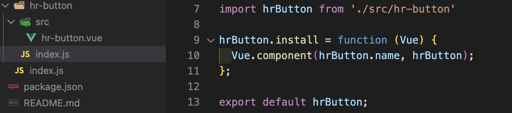

# NPM包的发布

## 想象中的npm包发布操作

- 初始化package.json, <code>npm init</code>
- 登录npm,设置用户名和邮箱, <code>npm login</code>
- 设置npm源, <code>npm config set registry</code>
- 修改package.json文件name version
- 发布，<code>npm publish</code>

```shell
npm init -y
npm login
npm config set registry https://registry.npmjs.org/
# version: 1.0.0 -> 1.0.1 
npm publish

```


好像是这么一回事，但是项目中实战会怎么样呢？


接下来，我们一步步完成它。


## 开发一个UI组件库

```shell
# 安装vue脚手架
npm install -g @vue/cli
# 创建一个项目，跟着脚手架的提示一步一步完成
vue create hroa-ui

```

### 修改src->examples

常规项目源文件会在src目录下，组件库项目的入口文件不在此，故为了区分两者的差别，我们将src改为examples，后续可以在examples引入我们自己写的UI组件进行引用调试。

<code>目录结构</code>


### vue.config.js修改入口文件
因为项目目录结构默认入口为 src/main.js，我们修改后src项目可能跑不起来，所以需要在配置文件中修改项目的入口文件指向 entry。

如图所示，此为vue-cli3版本的修改示例，其他版本同理。

<code>vue.config.js</code>


### 新增文件packages

packages为我们组件库的文件夹，我们可以在此创建多个组件。

比如，我们现在需要做一个按钮的公共组件，就得为每一个组件创建一个文件夹，方便我们管理后续导出。

在packages中新增文件夹hr-button，名字可以根据功能或者规范自己取。

### 在文件夹hr-button中新增index.js和hr-button.vue文件

在hr-button文件中创建组件。我这里创建把.vue文件放在src中，后续组件变大好维护。

<code>hr-button/src/hr-button.vue</code>
{width="300px"}

定义一个导出这个<code>hr-button</code>vue组件的js文件。为什么要创建这个文件下面解释

<code>hr-button/index.js</code>


### 在packages中新增index.js
在我们写完组件后，怎么去使用它呢。

vue引入组件的方式就两种，一种是局部引入import xxx form 'xxx'，一种是全局注册Vue.components。

所以我们就需要给组件定义一个install方法，方便引入组件的时候使用Vue.use注册组件。

<code>packages/index.js</code>


到此为止，我们的组件库开发基础工作已经完成了，剩下就是完善其他组件、打包、发布。
### package.json新增lib命令

```json
"lib": "vue-cli-service build --target lib --name hrui ./packages/index.js"
```
<code> --target lib</code>意思是让脚手架帮我们打包成各个模块化规范的库文件。

<code> --name hrui ./packages/index.js</code>意思是从package/index.js入口文件中打包生成 hrui名称的文件。 如 hrui.common.js、hrui.umd.js、hrui.css

执行 lib 命令 <code> npm run lib </code>，等待打包结束看 dist 文件夹

除此之外，还需要在package.json中新增字段。

```json
{
  ...
  "main": "./dist/hrui.common.js", // 指定项目的入口文件地址
  "description": "hroa-ui", // 关于这个包的描述文件
  "files": [ // 发布包需要带上文件，否则会根据.gitignore、.npmignore忽略掉文件
    "dist",
    "examples",
    "packages"
  ],
  "prepublishOnly": "npm run lib", // 执行npm publish的前置钩子
  ...
}
```
## 发布NPM包操作

磨刀不误砍柴工，先认识nrm帮我们更方便操作。
###  nrm介绍

nrm（NPM registry manager）是一个npm源管理工具，可以用来切换npm源，也可以用来查看npm源的地址。

```shell
# 安装nrm
npm i nrm -g 

# 列出npm源
nrm ls 

# 切换npm源 
# nrm use <registry>
nrm use npm  

# 新增npm源 
# nrm add <registry> <url> [home]
nrm add kye http://npm.company.com/ 

# 删除npm源
# nrm del <registry>
nrm del kye
```


### 3. 登陆npm
没有帐号则需要先去 npm官网[https://www.npmjs.com/]注册一个账号。
然后执行命令登陆
```shell
npm login
```


### 4. 发布npm包
需要在package.json中添加name、version、description等字段，然后执行命令
```shell
npm publish
```

### 5. 安装npm包
切换到需要安装的包的目录，执行命令
```bash 
npm i package-name
```

### 6. 升级npm包版本
如若该包进行更新后，需要再次发包，可 npm version 控制该版本进行升级，记住需要遵守 Semver 规范:
https://semver.org/lang/zh-CN/
```bash
# 增加一个修复版本号: 1.0.1 -> 1.0.2 (自动更改 package.json 中的 version 字段)
npm version patch

# 增加一个小的版本号: 1.0.1 -> 1.1.0 (自动更改 package.json 中的 version 字段)
npm version minor

# 将更新后的包发布到 npm 中
npm publish
```
## 项目中使用

### 在项目中使用组件

```shell
# 创建一个项目，跟着脚手架的提示一步一步完成
vue create use-our-npm

```


### 在main.js文件中引入UI组件

```js

// 全局引入UI组件
import hroaUI from "hroa-ui";
// 引入样式
import 'hroa-ui/dist/hrui.css';
// 组册
Vue.use(hroaUI)

```

### 在.vue文件中使用组件

```html
  <hr-button>hhh</hr-button>
```


## 本地调试

- 可以改变需要调试库的package.json中main字段，main字段表示入口文件，相对路径。
- npm link


## 拓展
- 钩子
- 工具生成 changelog